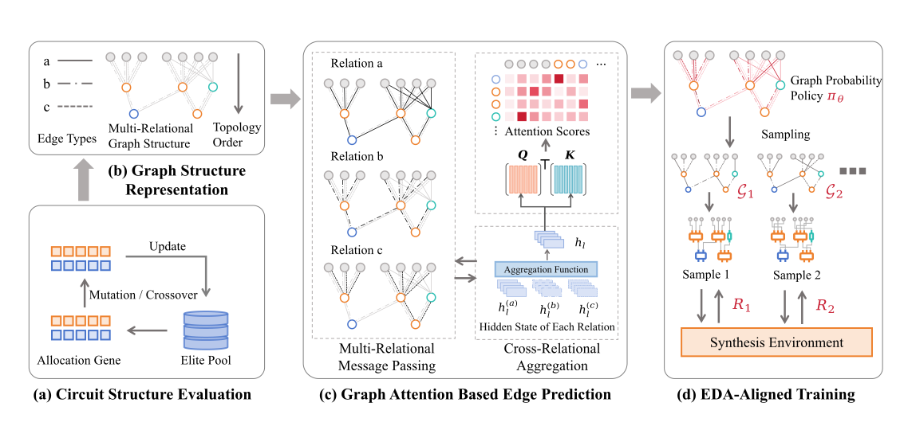

<p align="center">
  <!-- 短粗横线：宽度占容器 76%，深/浅色主题自适应 -->
  <svg width="100%" height="4" viewBox="0 0 100 4" preserveAspectRatio="none" xmlns="http://www.w3.org/2000/svg" role="img" aria-label="separator">
    <rect width="100" height="4" fill="currentColor"/>
  </svg>
</p>

<h1 align="center">
  High-Performance Arithmetic Circuit Optimization via Differentiable Architecture Search
</h1>

<p align="center">
  <svg width="100%" height="1" viewBox="0 0 100 4" preserveAspectRatio="none" xmlns="http://www.w3.org/2000/svg" role="img" aria-label="separator">
    <rect width="100" height="4" fill="currentColor"/>
  </svg>
</p>

<p align="center">
  Xilin Xia<sup>1</sup>&nbsp;&nbsp;
  Jie Wang<sup>1</sup><sup>*</sup>&nbsp;&nbsp;
  Wanbo Zhang<sup>1</sup>&nbsp;&nbsp;
  Zhihai Wang<sup>1</sup>&nbsp;&nbsp;
  Mingxuan Yuan<sup>2</sup>&nbsp;&nbsp;
  Jianye Hao<sup>2,3</sup>&nbsp;&nbsp;
  Feng Wu<sup>1</sup>
</p>

<p align="center"><small>
  <sup>1</sup> MoE Key Laboratory of Brain-inspired Intelligent Perception and Cognition,<br/> University of Science and Technology of China<br/>
  <sup>2</sup> Noahs Ark Lab, Huawei Technologies<br/>
  <sup>3</sup> College of Intelligence and Computing, Tianjin University
</small></p>

<figure>
  
  <figcaption>
    <center>Figure 1. Overview of our proposed ARITH-DAS framework.</center>
  </figcaption>
</figure>

### 1. Environment setup
#### 1.1 **EDA tools setup**
This project is build upon [Yosys](https://github.com/YosysHQ/yosys) for logic synthesis and [OpenROAD Flow](https://github.com/The-OpenROAD-Project/OpenROAD-flow-scripts) for STA simulation. We use [Verilator](https://github.com/verilator/verilator) for design verification. You can setup the EDA tools using following commands.

```shell
# OpenROAD Flow
## Clone and Install Dependencies
git clone --recursive https://github.com/The-OpenROAD-Project/OpenROAD-flow-scripts
cd OpenROAD-flow-scripts
sudo ./setup.sh

## Build
./build_openroad.sh --local

## Verify Installation
source ./env.sh
yosys -help
openroad -help

# Verilator
git clone https://github.com/verilator/verilator
mkdir build && cd build
cmake ..
make && make install
```

For Ubuntu system, Yosys and Verilator can be installed with `apt`, and OpenROAD provide official release at [Here](https://github.com/Precision-Innovations/OpenROAD/releases).
```bash
# Install Yosys and verilator
sudo apt update && sudo apt upgrade
sudo apt install yosys verilator

# Install OpenROAD
wget https://url.to.your.prefered.version/openroad_..._.deb
sudo apt install ./openroad_..._.deb

# Verify Installation
yosys -help
openroad -help
```

#### 1.2 **Python Environment setup**

You can setup the Python Environment with following commands.
```bash
conda create -n arith_das python=3.10
conda activate arith_das
pip install -r ./requirements.txt
```

After installation, please set the variable `lib_path` and `lef_path` in `utils/template.py` to the correct path of Liberty Timing File (.lib) and Library Exchange Format File (.lef).

```python
# utils/template.py:4
lib_path = "/path/to/NangateOpenCellLibrary_typical.lib"
lef_path = "/path/to/NangateOpenCellLibrary.lef"
```

### 2. Training
The main files are organized as follows:
* `./utils/`: Files for verilog generation and simulation.
  * `utils/template.py`: Template strings for verilog generations and synthesis scripts.
  * `utils/compressor_tree.py`: Main code for `CompressorTree` class, including verilog generation, initialization and legalization.
  * `utils/mul.py`: Main code for `Mul` and `Mac` class for verilog generation.
  * `utils/adder_utils.py`: Main code for prefix adder verilog generation.
  * `utils/common.py`: Shared usefull tools.
* `./trainer/`: Files for training.
  * `./trainer/arith_das.py`: Main training code for multiplier design.
  * `./trainer/arith_das_mac.py`: Main training code for MAC design.
* `./configs/`: Hyper paramters and training configs.
* `./pipeline.py`: Training pipeline with main function.

For example, to optimize a 16 bit multiplier:
```bash
# Run 16-bit AND-gate encoding mult.
python ./pipeline.py +config_groups=mul_16_and

# Run 16-bit Booth encoding mult. with seed 3407 and 4 processes
python ./pipeline.py +config_groups=mul_16_booth config_groups.experiment.kwargs.seed=3407 config_groups.experiment.kwargs.n_processing=4 config_groups.experiment.kwargs.experiment_prefix=enter_a_name_you_like
```

All hyperparameters used for training are set in the config file `./configs/config_groups/xxx.yaml`, e.g.,
* `experiment`: basic kwargs for the experiment, such as the `experiment_prefix`, `n_processing` and `seed`.
* `trainer`: kwargs for training, such as the learning rate (lr) and model params.

By default, the training log directory is structured as `outputs/YY-MM-DD/HH-MM-SS/xxx`. It contains the following:

* `.hydra`: Stores all configuration files used for this experiment.
* `{experiment_prefix}/build/`: Contains intermediate files generated by the training script.
* `{experiment_prefix}/logs/`: Contains the running logs generated by the training script.
* `{experiment_prefix}/logs/save_iterxxx/`: Contains the Check point information and design structure information.

### 3. Verification
Your can verify the generated designs with following commands.
First, please specify the correct path to your verilog design in `./CMakeLists.txt`.

```bash
# ./CMakeLists.txt:25
verilate(mul
    INCLUDE_DIRS "verilate"
    SOURCES path/to/MUL.v   <-- put the path to your design here
    TOP_MODULE MUL
)
```

Then please build and run the verilate process.

```bash
# update submodules
git submodule update --init

# build
mkdir build && cd build
cmake ..
make

# run verification
./mul_verilate # add_verilate, mac_verilate
```

### 4. Licenses
We sincerely credit the following opensource projects
- [OpenROAD Flow](https://github.com/The-OpenROAD-Project/OpenROAD-flow-scripts): BSD 3-Clause License
- [Yosys](https://github.com/YosysHQ/yosys): ISC License
- [OpenSTA](https://github.com/parallaxsw/OpenSTA): GPL-3.0 License
- [GOMIL](https://github.com/SJTU-ECTL/GOMIL): No Licene
- [ArithTreeRL](https://github.com/laiyao1/ArithmeticTree): No Licene
- [Verilator](https://github.com/verilator/verilator): LGPL-3.0 License
- [spdlog](https://github.com/gabime/spdlog): MIT License
